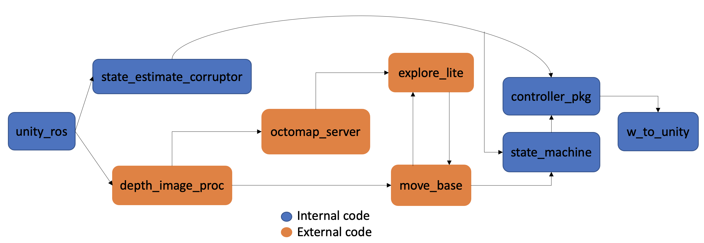
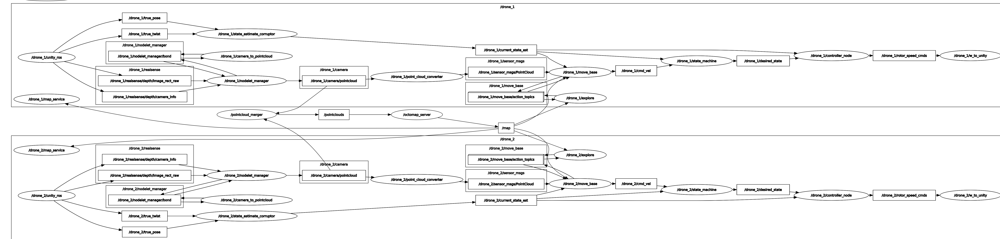

# FINAL PROJECT: Autonomous Drones

### A set of two drones exploring an unknown environment together, and merging the result as one octomap.

### Team: Help me, I'm droneing!
- Thomas Borge Skøien
- Geir Ola Tvinnereim
- Mohamad Ammach
- Vegard Haraldstad

### Dependencies:
Run the following commands to install the necessary dependencies:
```console
sudo apt install ros-noetic-explore-lite
sudo apt install ros-noetic-move-base
sudo apt-get install ros-noetic-octomap-server
```
### Spawning the simulation and initiating mission
```console
roslaunch simulation simulation.launch
roslaunch simulation mission.launch
```

If you get this error:
ERROR: cannot launch node of type [simulation/Two_Drones.x86_64]: Cannot locate node of type [Two_Drones.x86_64] in package [simulation]. 
Make sure file exists in package path and permission is set to executable (chmod +x)

Add the lightweight drone simulation to /devel/lib/simulation/, navigate to workspace and call:
```console
sh executable.sh
```

### Overview - Modularization and rqt_graph
 


## For more information, refer to the documentation file
[ROS_Documentation__Autonomous_Drones](doc/ROS_Documentation__Autonomous_Drones.pdf)

